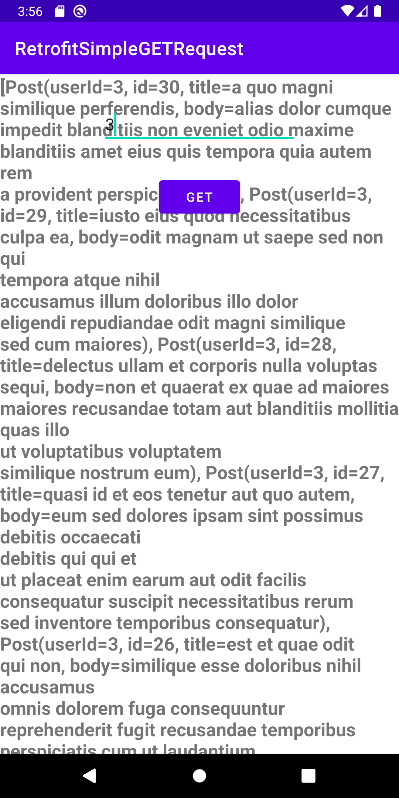
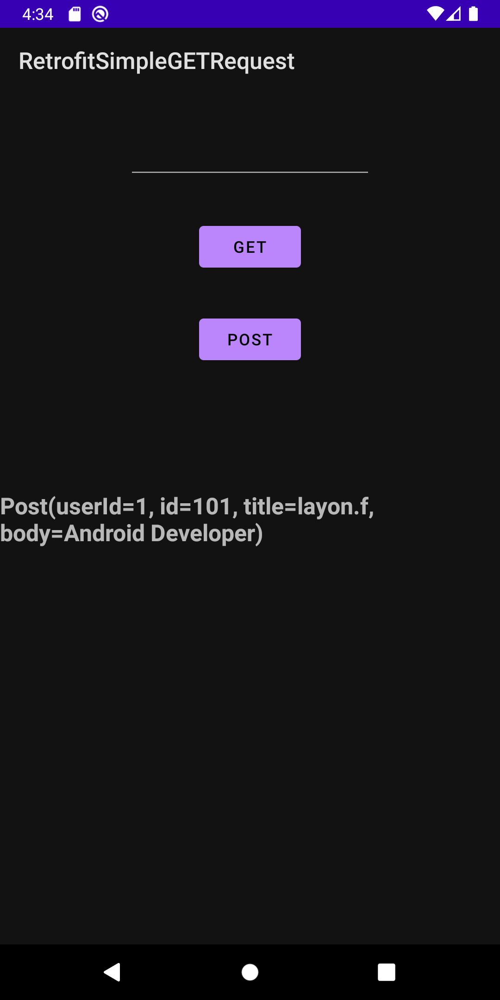
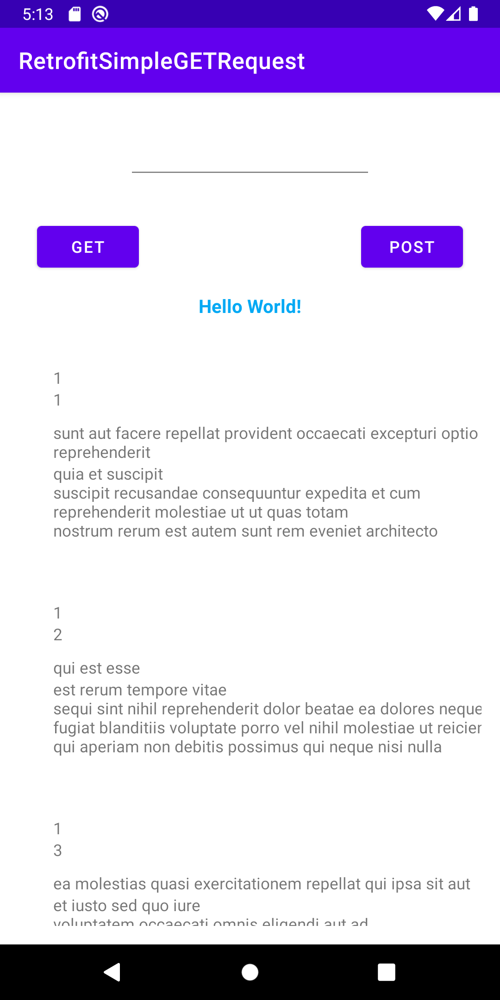

## An Android App example of how to use Retrofit

* Kotlin
* Retrofit
* Simple GET Request
* URL Manipulation @Path, @Query, @QueryMap
* Simple POST Request
* Display Retrofit result inside a RecyclerView

  

### Reference
* https://www.youtube.com/watch?v=uCJuprbXJk4&list=RDCMUCYLAirIEMMXtWOECuZAtjqQ&start_radio=1&rv=uCJuprbXJk4&t=416